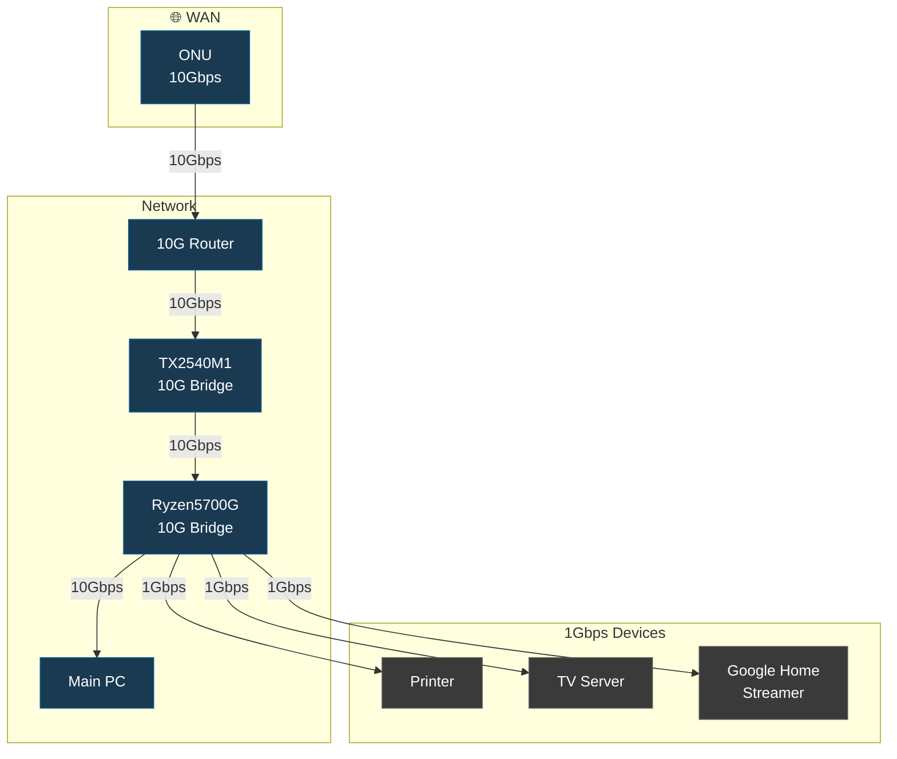

# 🏠 自宅ラボの物理構成（ポートフォリオ公開）

---

## 📌 概要

本リポジトリは、自宅ラボに構築した**物理インフラ構成**をポートフォリオとして公開するものです。  
ネットワーク、サーバー、電源、配線設計における実践的な工夫と設計思想を記録しています。

---

## 🎯 要件・背景

- 肥大化していくSteamゲームのダウンロード速度を確保したい  
- LAN内10G化とコストを両立させたい  
- 実験環境でもあるため、まずは「動くこと」を優先したい  

---

## 🖥️ 物理マシン一覧

| マシン管理名         | 用途                     |
|----------------------|--------------------------|
| Fujitsu TX2540M1     | ストレージサーバー       |
| 自作PC Ryzen 5700G機 | アプリケーションサーバー |
| 自作PC メインPC     | 普段使い                  |

---

## ⚙️ マシンスペック

### 🔹 TX2540M1

| 項目       | 名称                  | 仕様              |
|------------|-----------------------|-------------------|
| CPU        | Intel Xeon E5-2470v2  | 2ソケット 20C40T  |
| メモリ     | DDR3 ECC              | 192GB             |
| ストレージ | HP SAS HDD 6TB ×4     | 計24TB            |
| NIC        | X540-T2               | 2ポート 10GBASE-T |
| OS         | Proxmox               | 9.1               |

---

### 🔹 Ryzen 5700G機

| 項目       | 名称                  | 仕様              |
|------------|-----------------------|-------------------|
| CPU        | AMD Ryzen 5 5700G     | 8C16T             |
| メモリ     | DDR4                  | 64GB              |
| ストレージ | M.2 SSD Gen4          | 1TB               |
| NIC        | X540-T2               | 2ポート 10GBASE-T |
| OS         | Proxmox               | 9.1               |

#### 選定理由と制約駆動設計

**制約条件:**
- 既存HDD資産はメインサーバー（TX2540M1）で活用
- DDR4メモリの新規調達コスト抑制が必要
- Minecraft等の単スレッド性能要求ワークロード
- 省スペース構成でグラフィック出力も必要

**意思決定プロセス:**
- Xeon E5-2470v2は単スレッド性能（IPC）がMinecraftには不向きと判明
- Ryzen 5700G（Zen3アーキテクチャ）で高IPC・単スレッド性能を確保
- APU統合（Gモデル）でグラフィックスロット問題を解消
- DDR4 64GBで必要十分なメモリ帯域を確保

**結果:**
- Minecraftサーバーの応答性が大幅改善
- グラフィックカード不要により省スペース・低消費電力を実現
- 制約を技術選定によって設計上の強みに転換

---

### 🔹 メインPC

| 項目       | 名称                 | 仕様              |
|------------|----------------------|-------------------|
| CPU        | AMD Ryzen 9 9950X3D  | 16C32T            |
| メモリ     | DDR5                 | 64GB              |
| ストレージ | M.2 SSD Gen5         | 1TB               |
| NIC        | PCIe ×4レーン        | 1ポート 10GBASE-T |
| OS         | Windows 11 Home      | Home              |

---

## 🗺️ 構成図（物理接続関係）

以下は論理構成ではなく、**物理的な接続関係**を示した図です。

---

## 🧠 設計思想

### 💡 コスト最優先での10G構築

- ONUは2F設置、ルーターは10Gポート1系統のみという制約あり。
- 1FのメインPCまで10Gを通すには通常L2スイッチが複数台必要。
- 10Gスイッチは個人用途では依然として高価である。

### 🔁 スイッチレス・ブリッジ構成

- X540-T2を用いたブリッジ構成により、スイッチレスなデイジーチェーンを実現。
- 物理故障時はRJ45コネクタによるバイパス運用を想定。
- 単一障害点が多いことは認識した上で、コスト優先でリスクを受容。
- 差し替えのみで復旧可能な構成とし、下流影響は数分程度に抑えられる。

### 🔌 PoEスイッチ不採用の理由

- PoEスイッチは高価かつ設置場所の制約があるため不採用。
- 代替としてRyzen 5700G機に4ポートNICを追加。
- 定量的な実測値はないが、電力コスト削減にも一定の効果があると推測。

---

## 💰 コスト試算

メインPCでfast.comにて**実測4Gbps**を観測  
→ 最初の目標であるWANへの高速アクセスを達成。

### コスト結果

- X540-T2調達費: 2,500円 ×2 = 約5,000円  
- 想定10Gスイッチ構成: 約60,000円 ×2 = 約120,000円  

➡ **約115,000円の削減**  
➡ **約96%のコスト削減に成功**

最悪時はルーターとメインPCを直結する**フェイルセーフ構成**も確保しています。

---

## 🛣️ 今後のロードマップ（優先度降順）

- [ ] AP追加による1F Wi-Fi環境の改善  
- [ ] Ryzen 5700G機のメモリ増設  
- [ ] メインPCのメモリ増設  
- [ ] 可用性向上のため段階的に10Gスイッチを導入予定  

---

## 📜 ライセンス

MIT License

