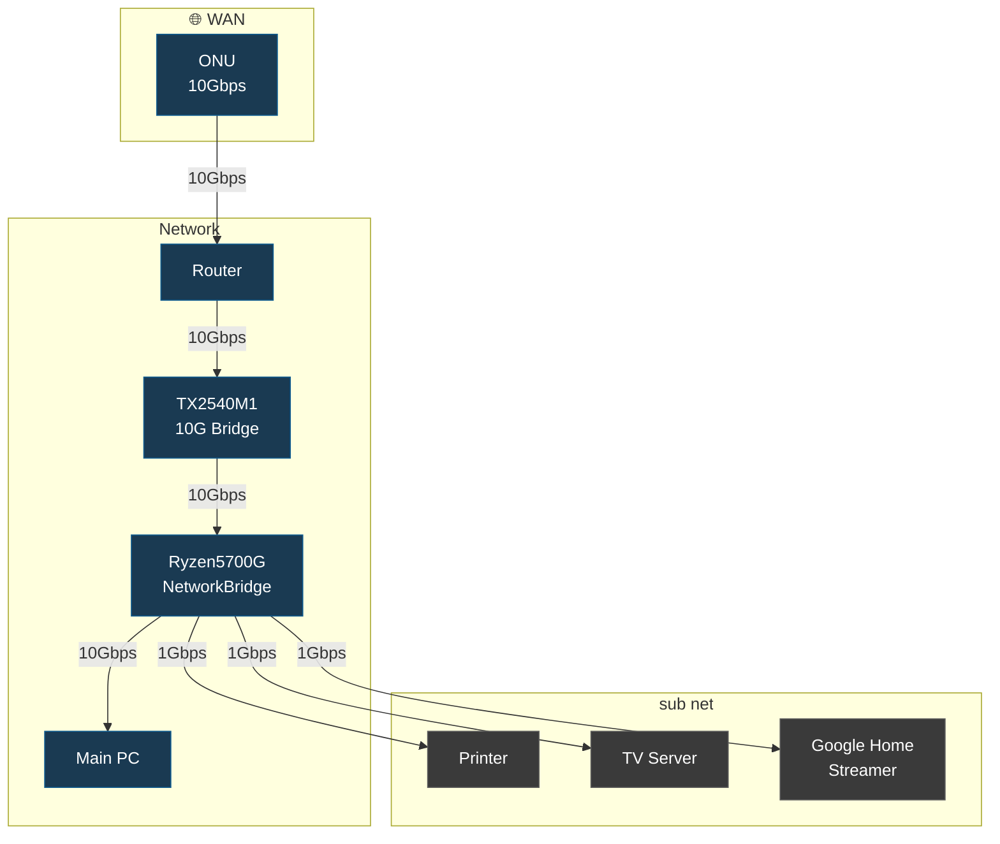

# 自宅ラボの物理構成図です。
## 物理マシン
| マシン管理名           |        用途 |
| :--------------- | --------: |
| Fujitsu TX2540M1 | ストレージサーバー |
| 自作PC Ryzen5700G機 |   Appサーバー |
| 自作PC メインPC       |      普段使い |

--- 

## マシンスペック
### TX2540M1

| component |                 Name |      Spec       |
| :-------- | -------------------: | :-------------: |
| CPU       | Intel Xepn E5-2470v2 | 2sckets 20C40T  |
| RAM       |             DDR3 ECC |      192GB      |
| Storage   |    HP SAS HDD 6TB x4 |      24TB       |
| NIC       |              X540-T2 | 2port 10GBASE-T |
| OS        |              Proxmox |       9.1       |
### Ryzen5700G機

| component |             Name |      Spec       |
| :-------- | ---------------: | :-------------: |
| CPU       | AMD Ryzen5 5700G |      8C16T      |
| RAM       |             DDR4 |      64GB       |
| Storage   |     M.2 SSD gen4 |       1TB       |
| NIC       |          X540-T2 | 2port 10GBASE-T |
| OS        |          Proxmox |       9.1       |
### メインPC

| component |               Name |      Spec       |
| :-------- | -----------------: | :-------------: |
| CPU       | AMD Ryzen9 9950X3D | 2sckets 20C40T  |
| RAM       |               DDR5 |      64GB       |
| Storage   |       M.2 SSD gen5 |       1TB       |
| NIC       |  PCIe slot x4 lane | 1port 10GBASE-T |
| OS        |          Windows11 |      Home       |

---
# 構成図

